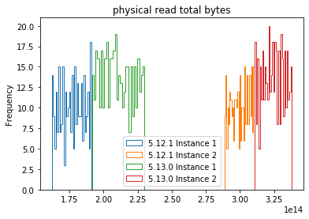
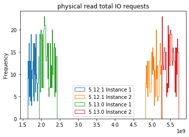

.. User I/O Degradation after Release Change documentation master file, created by
   sphinx-quickstart on Thu Jul  2 19:43:09 2020.
   You can adapt this file completely to your liking, but it should at least
   contain the root `toctree` directive.

Welcome to User I/O Degradation after Release Change's documentation!
=====================================================================

About the Project
-----------------

After database deployment of a new production release, performance monitoring
raised the suspicion of a degradation of User I/O. The project's objective is to
confirm or proof wrong the suspicion, adopting appropriate statistical methods.

About the Data
--------------

The database platform is an Oracle 11g RAC with 2 instances. I compaire 2
metrics from the dynamic performance view DBA_HIST_SYSSTAT:

- physical read total I/O request
- physical read total I/O bytes

The Results
-----------

Plots and Mann-Withney U-Test both confirm the User I/O degradation after
deployment of the new release, for both metrics. 5.12.1 is the "old" release,
5.13.0 the new release.

